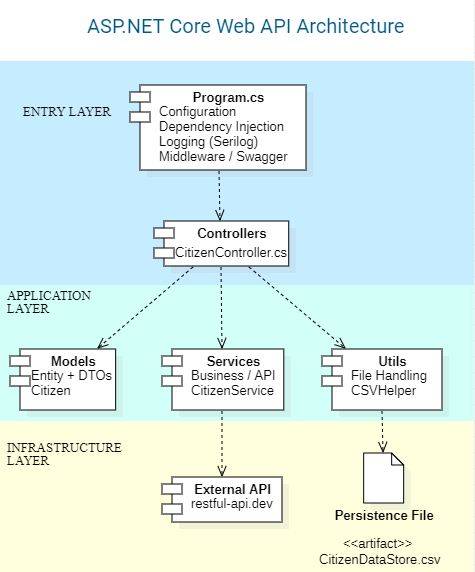

# CitizensAPI

< [EN](README.md) | [ES](README.es.md) >

Accede al contenido bilingue seleccionando tu idioma preferido arriba antes de continuar.

API de registro ciudadano construida con ASP.NET Core, persistencia en CSV, integracion con API externa y practicas de Twelve-Factor App.

> API web academica para `Certificacion I`, enfocada en operaciones CRUD, configuracion externa y una estructura de proyecto limpia.
> Estado: proyecto academico, funcional para el curso, no listo para produccion.

| Aspecto | Valor |
| --- | --- |
| Estilo de API | ASP.NET Core Web API basada en controllers |
| Persistencia | `CitizenDataStore.csv` |
| Servicio externo | `https://api.restful-api.dev/objects` |

## Tabla de Contenidos

- [👤 Informacion de la Autora](#author-information)
- [📌 Descripcion General](#project-overview)
- [🚀 Inicio Rapido](#quick-start)
- [🧭 Como Funciona](#how-it-works)
- [🧱 Arquitectura](#architecture)
- [📚 Explicacion de Twelve-Factor App](#12-factor-app-explanation)
  - [1. Codebase](#factor-1-codebase)
  - [2. Dependencies](#factor-2-dependencies)
  - [3. Config](#factor-3-config)
  - [4. Backing Services](#factor-4-backing-services)
  - [5. Build, Release, Run](#factor-5-build-release-run)
  - [6. Processes](#factor-6-processes)
  - [7. Port Binding](#factor-7-port-binding)
  - [8. Concurrency](#factor-8-concurrency)
  - [9. Disposability](#factor-9-disposability)
  - [10. Dev / Prod Parity](#factor-10-dev-prod-parity)
  - [11. Logs](#factor-11-logs)
  - [12. Admin Processes](#factor-12-admin-processes)
- [🔌 Endpoints de la API](#api-endpoints)
- [🧰 Stack Tecnologico](#tech-stack)
- [📋 Prerrequisitos](#prerequisites)
- [🧩 Instalacion y Configuracion](#installation--setup)
- [🗝️ Configuracion](#configuration)
- [▶️ Ejecucion de la Aplicacion](#running-the-application)
- [🗂️ Estructura del Proyecto](#project-structure)
- [💻 Desarrollo](#development)
- [🛠️ Solucion de Problemas](#troubleshooting)
- [🔒 Notas Criticas de Seguridad](#critical-security-notes)
- [🛡️ Mejoras de Seguridad](#security-improvements)
- [📚 Referencias](#references)
- [📞 Contacto y Soporte](#contact-and-support)
- [📝 Conclusion](#conclusion)

<a id="author-information"></a>
## 👤 Informacion de la Autora

`CitizensAPI` es un proyecto academico de ASP.NET Core Web API desarrollado por `Susan Laime Lucero` para `Certificacion I`, `Segundo Parcial`, con fecha `March 18, 2026`. El proyecto se mantiene en el repositorio `SusanLaime/CitizensAPI`, utiliza ASP.NET Core con Serilog, Swagger y persistencia en CSV, y esta documentado tanto en ingles como en espanol mediante `README.md` y `README.es.md`.

<a id="project-overview"></a>
## 📌 Descripcion General

CitizensAPI es una API Web en .NET disenada para administrar ciudadanos dentro de un sistema de registro. Soporta operaciones CRUD, persistencia basada en CSV, integracion con una API externa, logging estructurado con Serilog y configuracion mediante archivos `appsettings` y variables de entorno.

Cada registro de ciudadano incluye `FirstName`, `LastName`, `CI`, `BloodGroup` y `PersonalAsset`. La API tambien se integra con `https://api.restful-api.dev/objects` para asignar un activo personal aleatorio cuando se crea un nuevo ciudadano.

### Caracteristicas Principales

| Caracteristica | Descripcion |
| --- | --- |
| Operaciones CRUD | Crea, consulta, actualiza y elimina ciudadanos |
| Persistencia en CSV | Almacena los registros de ciudadanos en `CitizenDataStore.csv` |
| Integracion con API externa | Obtiene objetos aleatorios para asignar activos personales |
| Asignacion aleatoria de grupo sanguineo | Asigna automaticamente un grupo sanguineo valido al crear un ciudadano |
| Arquitectura basada en controllers | Organiza los endpoints usando controllers de ASP.NET Core |
| Configuracion por entorno | Carga ajustes desde `appsettings.json`, `appsettings.Development.json` y variables de entorno |
| Logging con Serilog | Registra eventos de la aplicacion en consola y archivos |
| Soporte con Swagger | Habilita pruebas interactivas de la API en desarrollo |
| Alineacion con Twelve-Factor | Documenta como el proyecto aplica los principios Twelve-Factor en la practica |

<a id="quick-start"></a>
## 🚀 Inicio Rapido

Antes de comenzar, asegurate de tener instalado el SDK de .NET 10 y una conexion a internet disponible para restaurar las dependencias desde NuGet y alcanzar la API externa.

> Importante: `dotnet restore` descarga las dependencias del proyecto y `dotnet build` verifica que la API compile antes de ejecutarla.

Si solo quieres ejecutar la API rapidamente, usa este flujo unico:

```bash
git clone https://github.com/SusanLaime/CitizensAPI.git
cd CitizensAPI
dotnet restore
dotnet build
dotnet run
```

Luego abre:

- Swagger UI: `https://localhost:9070/swagger`
- Documento OpenAPI: `https://localhost:9070/openapi/v1.json`
- Ruta base de ciudadanos: `https://localhost:9070/api/Citizen`

En la implementacion actual, Swagger usa la version de documento `v1` y la etiqueta de UI `My API V1`.

<a id="how-it-works"></a>
## 🧭 Como Funciona

### Estructura Basada en Controllers

El proyecto utiliza una arquitectura basada en controllers en lugar del estilo de minimal API. Este enfoque hace que la API sea mas clara, mas facil de mantener y mas facil de extender a medida que el proyecto crece.

La aplicacion inicia en `Program.cs`, donde carga la configuracion, configura Serilog, registra servicios y habilita Swagger en el entorno de desarrollo.

Las solicitudes del cliente son manejadas por `CitizenController`, que expone los endpoints CRUD para ciudadanos. El controller lee y actualiza los datos almacenados en `CitizenDataStore.csv`, mientras que `CitizenBGService` se conecta a la API externa para obtener objetos aleatorios usados como activos personales.

La logica de soporte esta separada en partes pequenas:

- `Models` define los objetos de dominio y de solicitud
- `Services` maneja la integracion externa
- `Utils` contiene logica auxiliar para lectura y escritura de CSV

Las decisiones de arquitectura, el flujo de configuracion, el modelo de ejecucion y el comportamiento operativo de la aplicacion se explican con mayor detalle en la seccion **Explicacion de Twelve-Factor App**, donde cada aspecto relevante del proyecto se conecta con su factor correspondiente.

<a id="architecture"></a>
## 🧱 Arquitectura



La aplicacion sigue una arquitectura por capas tipica de una ASP.NET Core Web API.

### 🔵 Capa de Entrada

Se encarga del inicio de la aplicacion y de las solicitudes entrantes.

- **Program.cs**: Configura la aplicacion, incluyendo inyeccion de dependencias, logging, middleware y Swagger.
- **Controllers**: Manejan las solicitudes HTTP entrantes y coordinan el flujo de la aplicacion.

### 🟢 Capa de Aplicacion

Contiene la logica principal y las estructuras de datos del sistema.

- **Models**: Definen las estructuras de datos y los objetos de solicitud/respuesta.
- **Services**: Gestionan la logica del negocio y la comunicacion con APIs externas.
- **Utils**: Manejan operaciones de persistencia en CSV y administracion de archivos.

### 🟡 Capa de Infraestructura

Gestiona sistemas externos y persistencia de datos.

- **External API**: Proporciona datos adicionales desde fuera de la aplicacion.
- **Archivo de persistencia (`CitizenDataStore.csv`)**: Almacena y recupera los datos de la aplicacion.


<a id="12-factor-app-explanation"></a>
## 📚 Explicacion de Twelve-Factor App

<a id="factor-1-codebase"></a>
### 1. Codebase

> One codebase tracked in revision control, many deploys.
> Un solo codebase rastreado en control de versiones, muchos despliegues.

El proyecto se administra en un unico repositorio Git y esta publicado en GitHub. El desarrollo se realizo mediante commits en la rama de practica `P2-001`.

Mantener el proyecto en un solo codebase compartido con historial visible favorece la trazabilidad y se alinea con este factor.

<a id="factor-2-dependencies"></a>
### 2. Dependencies

> Explicitly declare and isolate dependencies.
> Declarar y aislar dependencias de forma explicita.

Las dependencias estan declaradas explicitamente en el archivo `CitizensAPI.csproj`.

Referencias de paquetes actuales:

| Paquete | Version |
| --- | --- |
| `Microsoft.AspNetCore.OpenApi` | `10.0.3` |
| `Newtonsoft.Json` | `13.0.4` |
| `Swashbuckle.AspNetCore` | `10.1.5` |
| `Swashbuckle.AspNetCore.Swagger` | `10.1.5` |
| `Swashbuckle.AspNetCore.SwaggerGen` | `10.1.5` |
| `Swashbuckle.AspNetCore.SwaggerUI` | `10.1.5` |
| `Serilog` | `4.3.1` |
| `Serilog.AspNetCore` | `10.0.0` |
| `Serilog.Settings.Configuration` | `10.0.0` |
| `Serilog.Sinks.Console` | `6.1.1` |
| `Serilog.Sinks.File` | `7.0.0` |

<a id="factor-3-config"></a>
### 3. Config

> Store config in the environment.
> Almacenar la configuracion en el entorno.

La configuracion practica de la aplicacion se describe en la seccion [Configuracion](#configuration) mas abajo.

Desde la perspectiva Twelve-Factor, este proyecto externaliza la configuracion mediante `appsettings.json`, `appsettings.Development.json` y variables de entorno, en lugar de hardcodear valores operativos en controllers o servicios.

<a id="factor-4-backing-services"></a>
### 4. Backing Services

> Treat backing services as attached resources.
> Tratar los servicios de soporte como recursos adjuntos.

El proyecto utiliza el servicio externo:

- `https://api.restful-api.dev/objects`

Este servicio se trata como un recurso adjunto que puede reemplazarse o reconfigurarse sin cambiar la logica principal del negocio.

<a id="factor-5-build-release-run"></a>
### 5. Build, Release, Run

> Strictly separate build and run stages.
> Separar estrictamente las etapas de build y run.

La aplicacion separa las siguientes etapas:

- build: `dotnet build`
- run: `dotnet run`

La version liberable puede generarse desde el estado del repositorio y la configuracion, sin cambiar el codigo fuente.

En este proyecto, build y run se tratan como etapas separadas y repetibles.

<a id="factor-6-processes"></a>
### 6. Processes

> Execute the app as one or more stateless processes.
> Ejecutar la aplicacion como uno o mas procesos sin estado.

La API esta disenada para comportarse como un proceso web sin estado.

Los datos de ciudadanos no se almacenan permanentemente dentro de la aplicacion en ejecucion. En su lugar, los datos persistentes se guardan en el archivo CSV:

- `CitizenDataStore.csv`

Cada operacion lee el estado actual desde el archivo, aplica el cambio solicitado y escribe el estado actualizado de vuelta en el CSV. El proyecto tambien usa `async/await` para llamadas a la API externa, de modo que la aplicacion no bloquee innecesariamente mientras espera respuestas.

<a id="factor-7-port-binding"></a>
### 7. Port Binding

> Export services via port binding.
> Exponer servicios mediante enlace a puertos.

La aplicacion se expone a traves del servidor web de ASP.NET Core y puede accederse por el puerto local configurado al ejecutarse con `dotnet run` o con el perfil de lanzamiento.

En el repositorio actual, el endpoint local configurado es:

- `https://localhost:9070`

Esto se define en:

- `Properties/launchSettings.json`

Configuracion de lanzamiento actual:

```json
{
  "profiles": {
    "https": {
      "applicationUrl": "https://localhost:9070"
    }
  }
}
```

<a id="factor-8-concurrency"></a>
### 8. Concurrency

> Scale out via the process model.
> Escalar mediante el modelo de procesos.

Este factor no esta implementado completamente en el proyecto actual.

> Resumen: la API es mayormente stateless, pero la persistencia en CSV impide un escalado horizontal seguro.

En este proyecto, la aplicacion esta disenada de manera mayormente stateless a nivel de API, pero su capa de persistencia es un unico archivo CSV. El proyecto incluye bloqueo en proceso para acceso al archivo, lo cual ayuda a evitar corrupcion dentro de una sola instancia en ejecucion. Sin embargo, como la aplicacion reescribe el archivo CSV durante operaciones de creacion, actualizacion y eliminacion, todavia no ofrece coordinacion completa para multiples procesos o multiples instancias desplegadas.

Por esa razon, el proyecto no esta preparado para un escalado concurrente real entre multiples procesos o instancias. El uso de `async/await` mejora el manejo de llamadas a la API externa al evitar bloqueos innecesarios, pero por si solo no garantiza concurrencia segura ni escalabilidad horizontal. En este proyecto, la concurrencia se aborda solo de manera conceptual.

En el futuro, este factor podria aplicarse con mayor fuerza mediante:

- reemplazar la persistencia en CSV por una base de datos con transacciones y escrituras concurrentes
- agregar una estrategia mas segura de coordinacion de escritura
- ejecutar multiples instancias de la API detras de un balanceador
- separar solicitudes web de procesos worker en segundo plano si el sistema crece

<a id="factor-9-disposability"></a>
### 9. Disposability

> Maximize robustness with fast startup and graceful shutdown.
> Maximizar la robustez con inicio rapido y apagado ordenado.

La aplicacion inicia rapidamente con `dotnet run` y puede detenerse sin requerir pasos complejos de cierre, por ejemplo presionando `Ctrl + C`. Como los datos persistentes se almacenan en el archivo CSV, los reinicios del proceso no provocan perdida de informacion de ciudadanos.

<a id="factor-10-dev-prod-parity"></a>
### 10. Dev / Prod Parity

> Keep development, staging, and production as similar as possible.
> Mantener desarrollo, staging y produccion tan similares como sea posible.

Desarrollo y produccion deben permanecer lo mas similares posible mediante:

- usar el mismo codebase
- usar las mismas definiciones de dependencias
- usar archivos de configuracion y variables de entorno para valores especificos por entorno

Esto reduce diferencias innecesarias entre entornos.

Es importante evitar ruido especifico de una maquina en el repositorio y mantener el proyecto portable mediante configuracion y archivos generados ignorados.

<a id="factor-11-logs"></a>
### 11. Logs

> Treat logs as event streams.
> Tratar los logs como flujos de eventos.

Los logs se tratan como flujos de eventos escritos por la aplicacion.

La implementacion actual registra:

- creacion de ciudadanos
- actualizacion de ciudadanos
- eliminacion de ciudadanos
- llamadas a la API externa
- fallos de lectura de archivos
- fallos en operaciones de la API

> Resumen: el logging es una de las partes operativas mas fuertes del proyecto porque mejora la observabilidad, la solucion de problemas y el seguimiento de la ejecucion.

En este proyecto, Serilog usa niveles de log para controlar que eventos se registran. El orden de severidad comienza con `Debug`, seguido de `Information`, `Warning`, `Error` y `Fatal`.

Cuando `MinimumLevel` se establece en `Debug`, la aplicacion no registra solo mensajes debug. Registra todos los mensajes desde `Debug` hacia arriba, incluyendo `Information`, `Warning`, `Error` y `Fatal`. En otras palabras, `Debug` actua como el umbral mas bajo, por lo que todo nivel superior tambien queda incluido.

Esto es util en desarrollo porque permite un seguimiento detallado del comportamiento de la aplicacion, lo cual ayuda durante la depuracion.

En la implementacion actual, `Debug` se usa para trazas internas del flujo, como cargar el CSV, buscar ciudadanos, preparar escrituras de archivo y enviar solicitudes a la API externa. `Information` se usa para eventos exitosos del negocio, como cargar ciudadanos, crear un ciudadano, actualizarlo, eliminarlo o recibir datos validos desde la API externa.

`Warning` se usa para situaciones importantes que no rompen completamente la aplicacion. Por ejemplo, cuando no se encuentra un ciudadano, cuando se detecta un CI duplicado, cuando la API externa no devuelve activos disponibles o cuando se encuentran filas mal formadas en el CSV. `Error` se usa en bloques `try-catch` y escenarios de falla donde una operacion no pudo completarse correctamente, como errores de lectura de archivos, fallos de la API externa o excepciones CRUD.

Esto complementa la idea Twelve-Factor de tratar los logs como flujos de eventos porque la aplicacion no solo escribe logs, sino que tambien los clasifica por severidad y proposito. De esta manera, los logs se vuelven mas utiles para debugging, monitoreo, mantenimiento y comprension del comportamiento del sistema durante la ejecucion.

<a id="factor-12-admin-processes"></a>
### 12. Admin Processes

> Run admin/management tasks as one-off processes.
> Ejecutar tareas administrativas como procesos puntuales e independientes.

Este factor no esta implementado completamente como un proceso administrativo independiente de ejecucion unica en el proyecto actual.

> Resumen: el mantenimiento esta soportado indirectamente por los logs, pero todavia no existe un comando o script administrativo dedicado.

En este proyecto, el repositorio no incluye un script o comando especifico para tareas administrativas como:

- limpiar el archivo CSV
- reiniciar datos almacenados de ciudadanos
- sembrar registros iniciales
- migrar la estructura del archivo

Sin embargo, el proyecto ya incluye elementos de soporte que pueden ayudar a futuras tareas de mantenimiento y administracion.

Por ejemplo, la implementacion actual de logging ayuda con:

- revisar eventos de creacion, actualizacion y eliminacion de ciudadanos
- detectar fallos de la API externa
- identificar problemas de lectura o escritura de archivos
- apoyar solucion de problemas, mantenimiento y analisis operativo

Por ello, este factor se aborda solo de manera parcial y conceptual en esta practica.

Los logs brindan soporte util para mantenimiento y administracion, pero no reemplazan un verdadero proceso administrativo. En este proyecto, una tarea administrativa real seria un script o comando separado de ejecucion unica para actividades como limpiar `CitizenDataStore.csv`, precargar ciudadanos de ejemplo, reparar filas mal formadas o migrar la estructura del CSV si cambia el modelo.

En el futuro, este factor podria aplicarse de manera mas completa agregando un script o comando de mantenimiento dedicado para limpiar, reiniciar, sembrar o migrar los datos del CSV.

<a id="api-endpoints"></a>
## 🔌 Endpoints de la API

> Nota: las notas de respuesta en esta seccion documentan el comportamiento actual del controller en el repositorio, incluso cuando ese comportamiento es menos estricto que las convenciones REST ideales.

| Operacion | Endpoint | Resultado principal |
| --- | --- | --- |
| Crear ciudadano | `POST /api/Citizen` | Crea un ciudadano y asigna `BloodGroup` y `PersonalAsset` |
| Obtener todos los ciudadanos | `GET /api/Citizen` | Devuelve la lista actual de ciudadanos |
| Obtener ciudadano por CI | `GET /api/Citizen/{id}` | Devuelve un ciudadano si existe |
| Actualizar ciudadano | `PUT /api/Citizen/{ci}` | Actualiza solo `FirstName` y `LastName` |
| Eliminar ciudadano | `DELETE /api/Citizen/{ci}` | Elimina un ciudadano por CI |

### Crear Ciudadano

- `POST /api/Citizen`

Comportamiento:

- el cuerpo de la solicitud solo incluye `FirstName`, `LastName` y `CI`
- valida CI duplicado
- asigna un grupo sanguineo aleatorio
- llama a la API externa
- asigna un activo personal aleatorio
- guarda el ciudadano en el CSV

Ejemplo de solicitud:

```json
{
  "firstName": "Ana",
  "lastName": "Lopez",
  "ci": 123456
}
```

Forma del ciudadano creado:

```json
{
  "firstName": "Ana",
  "lastName": "Lopez",
  "ci": 123456,
  "bloodGroup": "O+",
  "personalAsset": "Apple Watch"
}
```

Comportamiento actual de respuesta:

- en exito devuelve `200 OK`
- el controller actualmente devuelve la lista completa de ciudadanos despues de crear
- un CI duplicado devuelve `409 Conflict`
- una falla del servicio externo de activos puede devolver `503 Service Unavailable`

### Obtener Todos los Ciudadanos

- `GET /api/Citizen`

Comportamiento actual de respuesta:

- devuelve `200 OK` con la lista completa de ciudadanos

Ejemplo de respuesta:

```json
[
  {
    "firstName": "Ana",
    "lastName": "Lopez",
    "ci": 123456,
    "bloodGroup": "O+",
    "personalAsset": "Apple Watch"
  },
  {
    "firstName": "Luis",
    "lastName": "Rojas",
    "ci": 654321,
    "bloodGroup": "A-",
    "personalAsset": "Keyboard"
  }
]
```

### Obtener Ciudadano por CI

- `GET /api/Citizen/{id}`

Comportamiento actual de respuesta:

- devuelve `200 OK` con el ciudadano cuando existe
- devuelve `200 OK` con un mensaje de texto cuando el ciudadano no existe

Ejemplo de respuesta:

```json
{
  "firstName": "Ana",
  "lastName": "Lopez",
  "ci": 123456,
  "bloodGroup": "O+",
  "personalAsset": "Apple Watch"
}
```

### Actualizar Ciudadano

- `PUT /api/Citizen/{ci}`

Regla de negocio:

- el cuerpo de la solicitud solo incluye `FirstName` y `LastName`
- solo se actualizan `FirstName` y `LastName`

Ejemplo de solicitud:

```json
{
  "firstName": "Ana Maria",
  "lastName": "Lopez"
}
```

Comportamiento actual de respuesta:

- devuelve `200 OK` con la lista completa de ciudadanos despues de actualizar
- si el CI no existe, el controller actualmente devuelve `200 OK` con un mensaje de texto

### Eliminar Ciudadano

- `DELETE /api/Citizen/{ci}`

Comportamiento actual de respuesta:

- devuelve `200 OK` con el ciudadano eliminado cuando existe
- si el CI no existe, el controller actualmente devuelve `200 OK` con un mensaje de texto

### Ejemplo de Formato CSV

Archivo: `CitizenDataStore.csv`

```csv
Susan,Laime,1,O+,Laptop
Juan,Perez,2,A-,Mouse
```

<a id="operational-notes"></a>
#### Notas Operativas

- Swagger esta habilitado en modo desarrollo.
- El proyecto usa finales de linea LF mediante `.gitattributes`.
- El archivo CSV es la capa de persistencia de esta practica.
- El perfil de lanzamiento actual usa `https://localhost:9070`.
- El repositorio sigue un estilo orientado a controllers en lugar del estilo minimal scripting.

Todos estos elementos ayudan a comprender como la aplicacion esta configurada, ejecutada y mantenida.

<a id="tech-stack"></a>
## 🧰 Stack Tecnologico

- **Framework:** ASP.NET Core Web API (`net10.0`)
- **Lenguaje:** C#
- **Documentacion de API:** OpenAPI + Swagger / Swashbuckle
- **Logging:** Serilog con sinks de consola y archivo
- **Integracion HTTP externa:** `HttpClient`
- **Manejo de JSON:** Newtonsoft.Json
- **Configuracion:** `appsettings.json`, `appsettings.Development.json` y variables de entorno
- **Persistencia:** almacenamiento en CSV mediante `CitizenDataStore.csv`
- **Control de versiones:** Git y GitHub

<a id="prerequisites"></a>
## 📋 Prerrequisitos

Antes de ejecutar el proyecto, asegurate de tener disponibles las siguientes herramientas:

- **.NET SDK 10.0**
- **Git**, si deseas clonar el repositorio y administrar versiones localmente
- **Visual Studio** o **Visual Studio Code** con soporte para C#
- **Conexion a internet**, porque la aplicacion consume `https://api.restful-api.dev/objects`

<a id="installation--setup"></a>
## 🧩 Instalacion y Configuracion

1. Clona el repositorio, restaura dependencias, compila y ejecuta la API.
2. Abre el proyecto en tu editor o IDE si deseas revisarlo o modificarlo.
3. Revisa los archivos de configuracion si necesitas cambiar rutas, logging o valores de entorno.

### Paso 1: Clonar, Restaurar, Compilar y Ejecutar

```bash
# SSH
git clone git@github.com:SusanLaime/CitizensAPI.git
cd CitizensAPI
dotnet restore
dotnet build
dotnet run
```

o

```bash
# HTTPS
git clone https://github.com/SusanLaime/CitizensAPI.git
cd CitizensAPI
dotnet restore
dotnet build
dotnet run
```

Esta secuencia descarga las dependencias del proyecto, verifica que el codigo compile e inicia la API localmente.

### Paso 2: Abrir el Proyecto

Abre el archivo de solucion en Visual Studio o la carpeta del proyecto en Visual Studio Code.

### Paso 3: Revisar la Configuracion

La aplicacion lee configuracion desde:

- `appsettings.json`
- `appsettings.Development.json`
- `Properties/launchSettings.json`

Estos archivos definen ajustes importantes como:

- ubicacion del almacenamiento CSV
- URL base de la API externa
- configuracion de Serilog
- valores del entorno local de desarrollo

<a id="configuration"></a>
## 🗝️ Configuracion

La aplicacion usa archivos de configuracion externos y variables de entorno para definir su comportamiento en ejecucion.

Las principales fuentes de configuracion son:

- `appsettings.json`
- `appsettings.Development.json`
- `Properties/launchSettings.json`
- variables de entorno

Estas fuentes controlan ajustes como:

- ubicacion del almacenamiento CSV
- URL base de la API externa
- niveles de log y salidas de Serilog
- seleccion de entorno mediante `ASPNETCORE_ENVIRONMENT`

Esta configuracion se carga en `Program.cs`, permitiendo mantener los valores operativos fuera de la logica del negocio.

Valores de ejemplo del proyecto actual:

```json
{
  "Data": {
    "Location": "D:\\UPB D\\UPB 5th Semester\\Certification I\\CitizensAPI\\CitizensAPI\\CitizenDataStore.csv"
  },
  "External Services": {
    "ObjectsApi": {
      "BaseUrl": "https://api.restful-api.dev/"
    }
  }
}
```

Nota: en la configuracion actual de desarrollo, `Data:Location` usa una ruta local absoluta de Windows. Esto coincide con el repositorio tal como esta hoy, pero reduce la portabilidad a menos que se sobrescriba mediante configuracion o variables de entorno.

Ejemplos de override con variables de entorno:

```powershell
$env:Data__Location="D:\\path\\to\\CitizenDataStore.csv"
$env:ASPNETCORE_ENVIRONMENT="Development"
```

<a id="running-the-application"></a>
## ▶️ Ejecucion de la Aplicacion

### Iniciar la API

Usa el siguiente comando para iniciar la API localmente:

```bash
dotnet run
```

### Funciones de Desarrollo

Cuando el entorno esta establecido en `Development`, la aplicacion tambien habilita:

- Swagger UI para probar endpoints
- configuracion especifica de desarrollo desde `appsettings.Development.json`
- mapeo OpenAPI mediante `app.MapOpenApi()`

### Notas

- Asegurate de que la API externa `https://api.restful-api.dev/objects` sea alcanzable
- Asegurate de que la ruta del archivo CSV configurada en app settings sea valida
- Los archivos de log se generan automaticamente mediante Serilog durante la ejecucion

<a id="project-structure"></a>
## 🗂️ Estructura del Proyecto

El repositorio esta organizado de la siguiente manera:

```text
CitizensAPI/
├── Controllers/
│   └── CitizenController.cs
├── Models/
│   ├── BloodGroups.cs
│   ├── Citizen.cs
│   ├── CitizenBG.cs
│   ├── CreateCitizenRequest.cs
│   ├── Response.cs
│   └── UpdateCitizenRequest.cs
├── Properties/
│   └── launchSettings.json
├── Services/
│   └── CitizenService.cs
├── Utils/
│   └── CSVHelper.cs
├── appsettings.Development.json
├── appsettings.json
├── CitizenDataStore.csv
├── CitizensAPI.csproj
├── CitizensAPI.sln
├── Program.cs
└── README.md
```

Los artefactos generados en ejecucion, como `Logs/`, `bin/` y `obj/`, no forman parte de la estructura central del codigo fuente y por eso se omiten en esta vista general.

| Area | Responsabilidad |
| --- | --- |
| `Controllers` | Expone los endpoints de la API y coordina las operaciones CRUD |
| `Models` | Contiene las entidades de dominio y modelos de solicitud |
| `Services` | Maneja la comunicacion con la API externa mediante `CitizenBGService` |
| `Utils` | Contiene logica auxiliar para persistencia en CSV |
| `Program.cs` | Configura el pipeline de la aplicacion, servicios, logging y Swagger |

<a id="development"></a>
## 💻 Desarrollo

### Flujo de Desarrollo

| Paso | Accion |
| --- | --- |
| 1 | Abrir el proyecto en Visual Studio o Visual Studio Code |
| 2 | Modificar controllers, services, models, archivos de configuracion o utilidades |
| 3 | Ejecutar `dotnet build` para verificar que el proyecto compile |
| 4 | Ejecutar `dotnet run` para validar el comportamiento localmente |
| 5 | Probar endpoints con Swagger y revisar logs junto con la persistencia CSV |

### Estilo de Codigo

- **Lenguaje:** C#
- **Estilo de arquitectura:** ASP.NET Core Web API basada en controllers
- **Formato:** Formato consistente de C# mediante las herramientas del IDE o editor
- **Convenciones de nombres:**
  - **Clases y archivos:** PascalCase, por ejemplo `CitizenController.cs`
  - **Metodos y propiedades:** PascalCase, por ejemplo `GetCitizenBGs`
  - **Campos privados:** `_camelCase`, por ejemplo `_httpClient`
  - **Variables locales y parametros:** camelCase, por ejemplo `citizenRequest`

### Patrones Clave de Desarrollo

| Elemento | Proposito |
| --- | --- |
| Controllers | Manejan solicitudes HTTP y coordinan el flujo de la aplicacion |
| Services | Encapsulan la comunicacion con APIs externas y la logica de soporte |
| Models | Representan cuerpos de solicitud y entidades de dominio |
| Utilities | Centralizan logica reutilizable como operaciones CSV |
| Configuration | Mantienen ajustes de ejecucion fuera de la logica del negocio mediante app settings y variables de entorno |
| Logging | Usa Serilog para registrar eventos de desarrollo y ejecucion con niveles adecuados |

### Validacion Durante el Desarrollo

| Validacion | Proposito |
| --- | --- |
| `dotnet build` | Verificar compilacion correcta |
| `dotnet run` | Ejecutar la API localmente |
| Swagger | Probar endpoints de forma interactiva |
| Salidas de Serilog | Revisar comportamiento en ejecucion y errores |

### Compilacion para Produccion

Una version publicable del proyecto puede generarse con:

```bash
dotnet publish -c Release
```

Este comando crea una salida optimizada para despliegue. La opcion `-c Release` indica a .NET que use la configuracion **Release** en lugar de la configuracion orientada a desarrollo.

Ejecutar `dotnet publish -c Release` no cambia el flujo normal de desarrollo. Despues de publicar, el proyecto puede seguir compilando y ejecutandose localmente con `dotnet build` y `dotnet run` como de costumbre.

<a id="troubleshooting"></a>
## 🛠️ Solucion de Problemas

| Problema | Verificacion |
| --- | --- |
| Problemas de compilacion | Ejecuta `dotnet restore` y `dotnet build`, verifica el SDK de .NET 10, los paquetes NuGet restaurados y la validez de `CitizensAPI.csproj` |
| Problemas de ejecucion | Ejecuta `dotnet run`, confirma que el proyecto compile primero, que el puerto este libre y que `launchSettings.json` tenga valores validos |
| Problemas de configuracion | Revisa `appsettings.json`, `appsettings.Development.json`, `Properties/launchSettings.json`, `Data:Location`, `External Services:ObjectsApi:BaseUrl` y `ASPNETCORE_ENVIRONMENT` |
| Problemas con la API externa | Verifica que `https://api.restful-api.dev/objects` sea alcanzable, que la URL base sea correcta y que los logs no muestren fallas de la API |
| Problemas de persistencia CSV | Confirma que la ruta del CSV exista, que la aplicacion tenga permisos de archivo y que el contenido sea valido |
| Problemas de logging | Revisa los ajustes de Serilog, `MinimumLevel`, rutas de salida y el entorno seleccionado |

### Comandos Comunes de Validacion

```bash
dotnet restore
dotnet build
dotnet run
dotnet publish -c Release
```

<a id="critical-security-notes"></a>
## 🔒 Notas Criticas de Seguridad

> Critico: la API actual no implementa autenticacion ni autorizacion, por lo que debe tratarse como un proyecto academico y no como un servicio seguro listo para produccion.

Desde una perspectiva de ciberseguridad, la limitacion mas critica del proyecto actual es la ausencia de autenticacion y autorizacion. Cualquier cliente que pueda alcanzar la API puede crear, leer, actualizar o eliminar registros de ciudadanos, lo que significa que el acceso a informacion personal no esta restringido adecuadamente.

Tambien existen otros riesgos de seguridad relevantes:

- `CitizenDataStore.csv` es aceptable para una practica academica, pero no es un mecanismo de persistencia fuerte para confidencialidad, integridad, auditoria o acceso concurrente controlado
- la API externa usada para activos personales debe tratarse como entrada no confiable y sus respuestas deben validarse cuidadosamente
- los logs son utiles para observabilidad, pero en un despliegue real deben evitar exponer datos personales innecesarios o detalles internos sensibles

El proyecto ya tiene algunas bases positivas de seguridad, incluyendo HTTPS local, configuracion fuera del codebase, Swagger limitado a desarrollo y logging estructurado mediante Serilog. Aun asi, el estado actual debe entenderse como una implementacion academica y no como un sistema seguro listo para produccion.

<a id="security-improvements"></a>
## 🛡️ Mejoras de Seguridad

Si el proyecto evoluciona mas alla del ambito academico, las mejoras mas importantes serian:

- agregar autenticacion y autorizacion para controlar quien puede acceder o modificar registros de ciudadanos
- reemplazar la persistencia en CSV por una base de datos con mejor control de acceso, integridad y capacidad de auditoria
- fortalecer la validacion de entradas y la validacion de respuestas de la API externa
- reducir logging sensible en produccion y usar niveles de log mas estrictos fuera de desarrollo
- mantener las acciones administrativas controladas y auditables
- mantener ramas protegidas y merges controlados como parte de una practica de desarrollo seguro

<a id="references"></a>
## 📚 Referencias

1. Wiggins, A. (2017). *The Twelve-Factor App*. https://12factor.net/
2. GitHub. (n.d.). *Managing rulesets for a repository*. GitHub Docs. https://docs.github.com/en/repositories/configuring-branches-and-merges-in-your-repository/managing-rulesets
3. GitHub. (n.d.). *Managing protected branches*. GitHub Docs. https://docs.github.com/en/repositories/configuring-branches-and-merges-in-your-repository/managing-protected-branches
4. Microsoft. (n.d.). *ASP.NET Core configuration*. Microsoft Learn. https://learn.microsoft.com/en-us/aspnet/core/fundamentals/configuration/
5. Microsoft. (2022, April 13). *Storing application secrets safely during development*. Microsoft Learn. https://learn.microsoft.com/en-us/dotnet/architecture/microservices/secure-net-microservices-web-applications/developer-app-secrets-storage
6. OWASP Foundation. (2023). *OWASP API Security Top 10*. https://owasp.org/API-Security/
7. serilog. (n.d.). *Serilog.AspNetCore*. GitHub. https://github.com/serilog/serilog-aspnetcore

<a id="contact-and-support"></a>
## 📞 Contacto y Soporte

Si tienes preguntas sobre el proyecto, la implementacion o la entrega del curso, puedes contactarme aqui:

- Autora: Susan Laime Lucero
- Email: `susanlaimel1@upb.edu`
- Ultima actualizacion: March 18, 2026
- Estado: proyecto academico en funcionamiento
- Licencia: MIT License

<a id="conclusion"></a>
## 📝 Conclusion

Este proyecto aplica los principios de Twelve-Factor App a un nivel practico al combinar gestion de configuracion, integracion con servicios externos, logging estructurado y una arquitectura simple orientada al mantenimiento. Aunque algunos factores, como concurrencia y procesos administrativos, solo estan implementados parcialmente, el repositorio documenta claramente tanto lo que ya funciona como lo que podria mejorarse en un desarrollo futuro.
